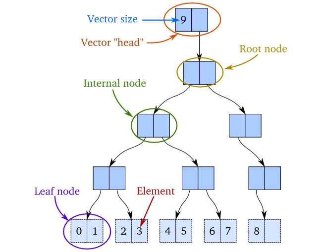
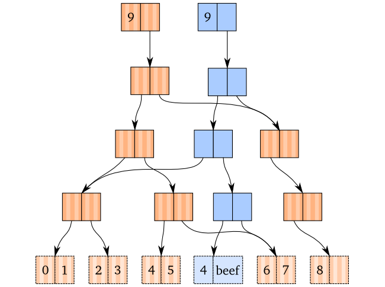
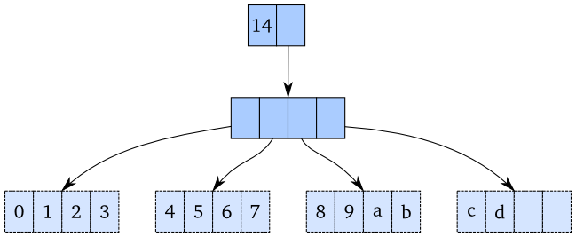
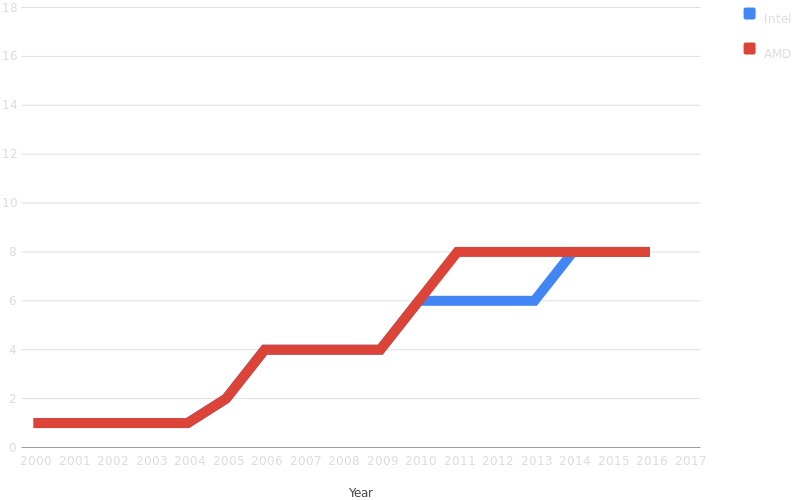
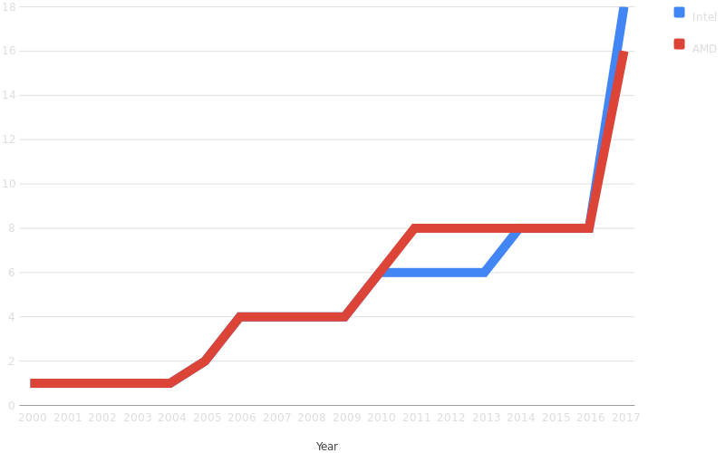

- title : Predictable Code
- description : Avoiding bugs by avoiding surprise
- author : Robin Munn
- theme : night
- transition : slide

***

## Predictable code

***

## What causes bugs?

' "James 4:1": What causes bugs and runtime errors among you?
' 
' The answer is *surprise*. You thought you knew what would happen, but what actually
' happened was not what you expected, so the code you wrote will do the wrong thing.
' E.g.,:
' 
' - What? A null? I didn't expect that function to ever return null. Oops.
' - What? A deadlock? I didn't expect these two threads to execute instructions in precisely that order. Oops.
' - What? Why did that global variable change? Oh, this function has a side-effect of changing global state. It shouldn't do that!
'     - (Not all surprise is your fault; sometimes the function you're calling is badly written.)

<ul>
<li>The root cause of all bugs is... </li>
<ul style="list-style: none" class="fragment"> <li><strong>SURPRISE</strong> </li></ul>
<li class="fragment">What? A <code>null</code>? I didn't expect that function to return null!</li>
<li class="fragment">What? A deadlock? I didn't expect the threads to run in that order!</li>
<li class="fragment">What? Why did that global variable change?</li>
<ul class="fragment"><li>... Oh. That other function changed it; that shouldn't have happened!</li>
    <li>(Not all surprise is your fault)</li></ul>
</ul>

---

## How to avoid surprise

<ul>
<li>Write <em>predictable</em> code</li>
<li>Write <em>simple</em> code
<ul>
<li class="fragment">Complexity causes misunderstanding</li>
<li class="fragment">Misunderstanding causes surprise</li>
<li class="fragment">Surprise causes bugs</li>
<li class="fragment">The path to the Green Screen are these</li>
</ul></li></ul>

' Next slide: How do we avoid surprise?
' 
' - Write *predictable* code. Your code should not contain any hidden surprises for other programmers.
' - Write *simple* code. Complexity causes misunderstanding, because you get to a point where
'   you can't hold the whole system in your head any longer. At that point, you start
'   to make mistakes where you thought that function you're calling works one way, but
'   it actually works another way.

***

## What makes code predictable?

- Hard to answer succinctly

' Hard to answer succinctly. Let's look at a different question first.

***

## What makes code **UN**predictable?

- Easier to answer
- Let's look at some examples

---

#### Sample function

    [lang=cs]
    void MyFunction(int[] input) {
        foreach (int i in input) {
            if (i < 0) {
                throw new InvalidSquareRootException(i);
            } else {
                Console.WriteLine("Square root of {0} is {1}", i, Math.Sqrt(i));
            }
        }
    }

' Let's say we have some code that requires valid input, and throws an exception if the input is invalid.
' We'll use this function in the next couple of examples.

---

#### Calling it with known data

    [lang=cs]
    var myImportantData = new int[] { 1,2,3 };
    MyOwnCode.MyFunction(myImportantData);

- What is the value of `myImportantData` here?
- This code is predictable

' What data will my function receive? I can predict that. BUT...

---

#### But what will happen now?

    [lang=cs]
    var myImportantData = new int[] { 1,2,3 };
    SomeoneElsesCode.OtherFunction(myImportantData);
    MyOwnCode.MyFunction(myImportantData);

<ul>
<li>Now what is the value of <code>myImportantData</code>?</li>
<li class="fragment">This code is <strong>un</strong>predictable
<ul><li>At least until you know what <code>OtherFunction</code> does</li></li>
</ul>

' How about now? Can I still count on this function not throwing an exception?
' *Only* if `OtherFunction` is predictable. What if `OtherFunction` looks like this?

---

#### The other function behind the curtain

    [lang=cs]
    void OtherFunction(int[] input) {
        for (int i=0; i<input.Length; i++) {
            if (input[i] % 2 == 0) {
                input[i] = -input[i];
            }
        }
    }

- Note that `OtherFunction` modifies its input in-place

' This is a silly, contrived example, of course. But I'm keeping it simple so that
' the examples are easy to understand at a glance. In real code, the modification might be
' normalizing every string in the input to NFC, or something else that's sensible.

---

#### I can't predict my own code!

    [lang=cs]
    var myImportantData = new int[] { 1,2,3 };
    SomeoneElsesCode.OtherFunction(myImportantData);
    MyOwnCode.MyFunction(myImportantData);  // Throws an exception!

- I cannot predict how my own code will behave!
- This will certainly cause a bug sooner or later

' Because `OtherFunction` modifies its input in-place, suddenly I cannot predict
' how my own code is going to behave. I have to know the implementation of
' `OtherFunction` before I can actually trust my own code. So my code has become
' less predictable, and my mental burden is higher.
' 
' How could we have made `OtherFunction` more predictable? Well, if it didn't modify
' its input, then it would have looked like this:

---

#### Safer implementation

    [lang=cs]
    int[] OtherFunction(int[] input) {
        int[] result = input.Clone()
        for (int i=0; i<result.Length; i++) {
            if (result[i] % 2 == 0) {
                result[i] = -result[i];
            }
        }
        return result;
    }

' Now instead of modifying its input in-place, it returns a new output
' With that implementation, if we now did this:

---

#### Now I can predict my own code again!

    [lang=cs]
    var myImportantData = new int[] { 1,2,3 };
    SomeoneElsesCode.OtherFunction(myImportantData);
    MyOwnCode.MyFunction(myImportantData);

' Or rather, this: (slide transition is a fade for this one: put it before AND after in the HTML):

---

#### Now I can predict my own code again!

    [lang=cs]
    var myImportantData = new int[] { 1,2,3 };
    var resultForLater = SomeoneElsesCode.OtherFunction(myImportantData);
    MyOwnCode.MyFunction(myImportantData);

- Now we know `myImportantData` will not change

' This allows us to predict what `MyFunction` will do with my important data,
' because we know that it's not going to be changed by someone else's code.
' So this brings us to the first principle of writing predictable functions:

---

### Predictable Principles

1. Predictable functions should not modify their input.
    - Return a new value instead.

' Now, sometimes the code that's calling your function might *expect* the input
' to be modified, if you've documented it well. None of these rules are set in
' stone, and there are exceptions to all of them. But *in general*, you want to
' not modify your input if you can avoid it.

---

### Another example

    [lang=cs]
    enum MoonPhase { NEW, WAXING, FULL, WANING };
    MoonPhase currentPhase;
    bool isTheMoonFull() {
        return (currentPhase == MoonPhase.FULL);
    }

    IPerson createPerson(string name) {
        return isTheMoonFull() ? new Werewolf(name) : new Person(name);
    }

- What will `createPerson()` do?
- Can't tell just by looking at input
- Depends on some external source

' What will happen when I call `createPerson()`? I don't actually know just by
' looking at the inputs. Its output will vary based on some global variable,
' which might even be in a different file — or maybe theMoonIsFull() is a method
' from a different class or something — `if (theMoon.IsFull) { ... }`.
' 
' This example actually gives us both the second AND third rules of predictable functions:

---

### Predictable Principles

1. Predictable functions should not modify their input.
    - Return a new value instead.
2. Predictable functions should depend only on their input.
    - (By the way, this also greatly simplifies unit testing)
3. Predictable functions should be idempotent.
    - Given same input, always return same output
    - (BTW, this allows optimization by caching)

' 3. Predictable functions when given the same input, should always return the same value.
' 
' Now, sometimes the code that's calling your function might *expect* the input
' to be modified, if you've documented it well. None of these rules are set in
' stone, and there are exceptions to all of them. But *in general*, you want to
' not modify your input if you can avoid it.

---

#### Why is this code unpredictable?

    [lang=cs]
    enum MoonPhase { NEW, WAXING, FULL, WANING };
    MoonPhase currentPhase;
    bool isTheMoonFull() {
        return (currentPhase == MoonPhase.FULL);
    }

    IPerson createPerson(string name) {
        return isTheMoonFull() ? new Werewolf(name) : new Person(name);
    }

- The `createPerson` function here breaks two rules
    - Has an external dependency
    - Output can vary even with same input

' The `createPerson` function here breaks both of these rules. The `isTheMoonFull()` function
' creates an external dependency on the current moon phase, which is not reflected in the
' function signature of `createPerson`. In this example, of course, both functions fit on the
' same screen so it's easy to spot the external dependency, but in real code, those functions
' might get moved further apart in the file, or even moved into different files, which would
' eventually result in surprise (and thus, bugs). "What? I had no idea that the `createPerson`
' function would depend on the moon phase!" And so you write code that assumes that you'll
' always get a Person instance, and when it receives a Werewolf instance instead (which has
' different behavior), your code has bugs because you didn't anticipate that possibility.
' Programmer surprise == bugs.
' 
' And the `createPerson` function also breaks the third rule of predictable functions, because
' its output will not always be the same. One day I call `createPerson("Warren Zevon")` and I
' get a `Person` instance, then a week later I call the same function with the same input and
' I get a `Werewolf` instance.

---

- Unpredictability is not always bad
- `Random.Next()` *should* be unpredictable
- So should `DateTime.UtcNow`, for other reasons

' NOTE: This is not always bad. For example, the function `Random.Next()` and the property
' `DateTime.UtcNow` are both unpredictable — but they *should* be unpredictable, or they're
' not doing what they should be doing.

---

    [lang=cs]
    class Werewolf {
        private bool _inWolfForm = false;
        public void checkMoonPhase(IMoonPhase theMoon) {
            _inWolfForm = theMoon.IsFull ? true : false;
        }
        public string visit(string cityName) {
            if (_inWolfForm || cityName == "London") {
                return "Awoooo!";
            } else {
                return $"Hello, {cityName}!";
            }
        }
    }
    // Example usage
    var Warren = new Werewolf();
    OtherCode.someFunction(Warren);
    Warren.visit("Paris");

- Instance variables can also cause unpredictability
- Same effect as global variables from function's POV

' Also, here's another example showing how even instance variables can make things unpredictable:
' If we call `visit` with the input "Paris", will the output be "Hello, Paris!"?
' Or will it be "Awoooo!"? We don't know until we know how `someFunction` works:
' does it call `checkMoonPhase` or not?
' The `visit` method has a *hidden dependency* on the `checkMoonPhase` method!
' Any time you see the `visit` method, you need to know whether `checkMoonPhase`
' has been called beforehand. So you've greatly increased the complexity of your
' code by writing the `Werewolf` class like this: because the `visit` function
' has a hidden dependency on `checkMoonPhase`, you can't predict what the `visit`
' method will do in any given situation, unless you understand the *entire
' program path* between when you created that instance and when you called its
' `visit` method. This makes it very hard to refactor the `visit` function, or
' call it in isolation in a unit test.

---

    [lang=cs]
    class Werewolf {
        public static bool checkMoonPhase(IMoonPhase theMoon) {
            return theMoon.IsFull ? true : false;
        }
        public string visit(string cityName, bool inWolfForm) {
            if (inWolfForm || cityName == "London") {
                return "Awoooo!";
            } else {
                return $"Hello, {cityName}!";
            }
        }
    }
    // Example usage
    var Warren = new Werewolf();
    OtherCode.someFunction(Warren);
    bool moonFull = false; // Or moonFull = Warren.checkMoonPhase();
    Warren.visit("Paris", moonFull);

- Not yet 100% predictable (still has external dependency)
- But `visit` method is predictable now

' This class is still not 100% predictable code since it depends on an external
' factor, the moon... but the `visit` function has become predictable. Its
' dependencies are all obvious, and it is not tracking any kind of internal state
' that isn't visible in its parameters. So we can safely pass a `Werewolf` instance
' to other code without worrying that the other code will change the behavior of
' the instance we have a reference to. Our `Werewolf` class has become *immutable*.

***

## List example

- No code for this one since it's easy to imagine

---

### Problem specification

- Have a list of names and addresses
- Want to print envelopes on laser printer
- Printing is slow, so don't block UI

' Another example, this time without code because it's pretty easy to visualise.
' 
' Let's say you're writing a mailing-list manager program, something like TntMPD. You
' have a list of names and addresses that you're going to send to the laser printer
' to print on envelopes. It prints one envelope at a time, so the whole batch will
' take about 5 minutes, so you don't want to freeze the UI during printing.

---

### How do we solve this?

- Do printing on a background thead?
- Background thread == parallelism
- Parallelism is ***HARD***.

' So how do you approach this problem? Because there's danger here: you've just added *parallelism*.
' And as anyone with any experience knows, parallelism is *HARD*.

---

### Naïve approach without locks

- Two roommates, Jerry Brown and John Smith
- Update their address while halfway through printing
- Results in inconsistent output

' First let's look at a naïve approach: you just launch a background thread to print
' the envelopes, and let the user continue to use the UI. Then what can happen is this.
' You have several people on your mailing lists who are single people living together
' as roommates. John Smith and Jerry Brown both live at 123 Main St. But because your
' records are sorted by last name, they are in two different parts of the data. Now,
' as you print out envelopes, you've already printed out Jerry Brown's envelope, but
' you haven't yet printed out an envelope for John Smith. Then the user updates the
' records for Jerry Brown and John Smith, because they've recently moved to 456 Washington Dr.
' They still live together, so the user updated both records, well before the printing
' process gets around to printing John Smith's envelope. So now you've printed an envelope
' for Jerry Brown at 123 Main St., and John Smith at 456 Washington Dr., and your program
' gives the false impression not entirely gonethat the roommates don't live together anymore.

---

### How to avoid this?
#### Attempt #1: lock the whole list

- Now UI is locked in read-only mode
- Lost the benefit of the background thread

' To avoid that, you could lock the whole list as you print it, but then you've lost the
' benefit of keeping the UI active.

---

### How to avoid this?
#### Attempt #2: copy the list first

- Window of vulnerability is smaller
- But still vulnerable anyway

' Or you could make a copy of the list and then print
' from your local copy, which means that you might not be printing the *latest* data,
' but at least you'd be printing *consistent* data. (I.e., both roommates would still
' show at their old location). However, then you've only narrowed the window of vulnerability,
' not removed it: no matter how fast the copy runs, it isn't atomic, and some other process
' could still do an update while you're in the middle of the copy and you'd get inconsistent
' data anyway.

---

### How to avoid this?
#### Attempt #3: lock list, copy it, unlock it

- Can't get inconsistent data
- Locks have other issues
    - Deadlocks
    - Resource starvation
    - "Lock convoys"

' The only safe way to do it is to lock the list, copy it, then unlock it.
' And even that isn't completely safe, because whenever you're dealing with locks, there
' are complications. Deadlocks, resource starvation, and "lock convoys" are just some of
' the problems that can happen when you introduce locks into your code. ("Lock convoys"
' are where threads are queueing up to get a lock, and threads arrive in the queue faster
' than the ones at the head can acquire the lock and leave the queue, so it just gets longer
' and longer until your program grinds to a halt.) But there's no
' other way to do parallelism safely than with locks... or is there?

---

### Another way to do it

- Requires paradigm shift
- Don't modify lists in-place
- Every operation returns a new list
- Data structures are **immutable**
- We'll look at performance in a minute

' Turns out there is another way to do parallelism safely, but it requires a paradigm shift.
' Most programmers are used to modifying data in-place, but what if every modification you
' did to your data returned a *new* data structure, leaving the old one unchanged? This is
' the "immutable data" paradigm. There would be a performance loss, of course, but we'll look
' at performance in a minute. Right now let's just look at semantics. If the `List.Add` method
' returns a new list, and the old list is unmodified, then you can just pass a reference to
' your printing function and it doesn't have to make its own copy. The address update will
' create a new list, and the reference that your printing function is holding onto still
' contains the same data that it used to. So the effect is just like making a defensive copy:
' you'll print consistent data, but it might be a few minutes out of date. However, the
' printing function is a lot simpler since it doesn't have to be paranoid about locking: it
' can be a simple for loop. So you've lost some performance, but you've gained simplicity.

---

### Performance implications

- Copying arrays is O(N)
- Appending N items would be O(N²) if you copy each time
- No way around this... **if** you use arrays

' Now let's talk about performance. If you're storing your data in an array, then every
' time you make a copy, you're copying the whole array. No way around that O(N) performance,
' and that makes the immutable-data paradigm look like a bad idea. But there are other data
' structures that you can use.

---

### Other ways to represent lists

' If you use a B-tree and put your data in leaf nodes only, you can treat that as if it was
' a list. Then when you update an item, you only copy that leaf nodes, and all the nodes
' above it on a path to the root. The other nodes can stay in place. The old root still points
' to a list containing the old data, and the new root points to a list containing the new data.
' And the only copies you have to make are a single path to the root. If you have two items
' in each leaf, then the number of nodes in that path is on the order of log-2 N. If you have
' four items in each leaf, then you have log base 4 of N nodes to copy. Most implementations of
' this data structure is a branching factor of 32, so each of these leaf nodes has 32 items in
' it. So in a list of 1024 items, you need to copy one 32-item leaf node, and one 32-item root.
' By copying 64 items, you've effectively copied the entire list. In a list of 32 *thousand* items,
' you have to copy 96 items to update one. So while the performance of this immutable data
' structure is slightly less than the naïve array-based implementation, it's still good enough
' that in practice, you won't notice a slowdown.

---

### Updating an item

' If you use a B-tree and put your data in leaf nodes only, you can treat that as if it was
' a list. Then when you update an item, you only copy that leaf nodes, and all the nodes
' above it on a path to the root. The other nodes can stay in place. The old root still points
' to a list containing the old data, and the new root points to a list containing the new data.
' And the only copies you have to make are a single path to the root. If you have two items
' in each leaf, then the number of nodes in that path is on the order of log-2 N. If you have
' four items in each leaf, then you have log base 4 of N nodes to copy. Most implementations of
' this data structure is a branching factor of 32, so each of these leaf nodes has 32 items in
' it. So in a list of 1024 items, you need to copy one 32-item leaf node, and one 32-item root.
' By copying 64 items, you've effectively copied the entire list. In a list of 32 *thousand* items,
' you have to copy 96 items to update one. So while the performance of this immutable data
' structure is slightly less than the naïve array-based implementation, it's still good enough
' that in practice, you won't notice a slowdown.

---

### Higher branching factors

' If you use a B-tree and put your data in leaf nodes only, you can treat that as if it was
' a list. Then when you update an item, you only copy that leaf nodes, and all the nodes
' above it on a path to the root. The other nodes can stay in place. The old root still points
' to a list containing the old data, and the new root points to a list containing the new data.
' And the only copies you have to make are a single path to the root. If you have two items
' in each leaf, then the number of nodes in that path is on the order of log-2 N. If you have
' four items in each leaf, then you have log base 4 of N nodes to copy. Most implementations of
' this data structure is a branching factor of 32, so each of these leaf nodes has 32 items in
' it. So in a list of 1024 items, you need to copy one 32-item leaf node, and one 32-item root.
' By copying 64 items, you've effectively copied the entire list. In a list of 32 *thousand* items,
' you have to copy 96 items to update one. So while the performance of this immutable data
' structure is slightly less than the naïve array-based implementation, it's still good enough
' that in practice, you won't notice a slowdown.

---

### Performance

- Random access by index: effective **O(1)**
    - Technically O(log₃₂N)
    - But that's 7 or less for 2³² items
- Appending an item: **O(1)**
- Removing the last item: **O(1)**
- Inserting item at arbitrary index: **O(N)**
    - But I'm working on improving that
    - Will be **O(1)** when I'm finished
- Deleting item at arbitrary index: **O(N)**
    - But I'm working on improving that, will also be **O(1)**
- Splitting into two lists: **O(N)**
    - But... yeah, you get the idea. Will be **O(1)** also
- Concatenating two lists: **O(N)**
    - ... yep. Will also be **O(1)**, though with large constant factor

' Accessing any item: effective O(1) - really O(log₃₂N) but that's got an upper bound of 7 for 2³² items, so effectively constant
' Appending an item: O(1)
' Popping last item: O(1)
' Inserting any item into the middle: O(N), but I'm working on fixing that. Will be O(1) when I'm done.
' Deleting any item from the middle: O(N), but I'm working on fixing that. Will be O(1) when I'm done.
' Splitting into two lists: O(N), but I'm working on fixing that. Will be O(1) when I'm done.
' Concatenating two lists: O(N), but I'm working on fixing that. Will be O(1) (though with a large constant factor of about 1024) when I'm done.

***

## Why does it matter?

' So why am I spending so much time on parallelism? Because of this graph:

---

### # of cores in consumer CPUs

' At the moment, most people have 4-core machines, so parallelizing your code gets you up to a
' theoretical 4x speedup. There's empirical evidence that parallelized code using data structures
' like the B-tree I showed you runs slower per thread, typically by anywhere from 20-50%. So if
' your algorithm runs, say, 100% slower per thread, splitting it across two cores gains you nothing
' for the work you put into rewriting the algorithm. Splitting it across four cores gets you an
' algorithm that finishes twice as fast as the single-threaded version, but that's not necessarily
' worth your time. And only the enthusiasts have 8-core machines right now.

---

### # of cores in consumer CPUs

' But that's about to change. This year, both Intel and AMD released 16-core versions of their CPUs.
' Intel's CPU actually has up to an 18-core version! This costs $2,000 for the CPU alone, so you're
' not going to see these 16-core CPUs in our users' machines any time soon. But give it five to ten
' years, and that's going to change. We're going to see a lot more CPU cores. And where you might
' have only doubled your speed splitting a program across four processors, you'd multiply your speed
' by *eight* if it's split among 16 processors. Suddenly the effort of switching to a parallelized
' algorithm is worth it.

---

### Parallelism is coming

' And what do we know about parallelism?
' 
' (Show "Mutable data = HARD" table. First a slide with four lines, then the graph. Order of lines
' on the slide is mutable/single, mutable/parallel, immutable/single, immutable/parallel. Then
' show the table as a summary, since the mutable/parallel line has some subpoints about locking).

---

### Parallel or not? Mutable or not?

<ul>
<li class="fragment"><strong>Single</strong>-threaded code, <strong>mutable</strong> data: <strong>easy</strong>
<ul class="fragment"><li>With the caveats that we just saw, of course</li></ul></li>
<li class="fragment"><strong>Multi</strong>-threaded code, <strong>mutable</strong> data: <strong style="color: red"><em>HARD!</em></strong></li>
<ul class="fragment"><li>Race conditions, deadlocks, and resource starvation, oh my!</li></ul></li>
<li class="fragment"><strong>Single</strong>-threaded code, <strong>immutable</strong> data: <strong>easy</strong></li>
<ul class="fragment"><li>Though it does require a paradigm shift</li></ul></li>
<li class="fragment"><strong>Multi</strong>-threaded code, <strong>immutable</strong> data: <strong style="color: #22ff22"><em>EASY!</em></strong></li>
<ul class="fragment"><li>No locks needed at all!</li>
<li>Just as easy as single-threaded</li></ul></li>
</ul>

***

## Appeal to authority

' Now I'm going to do a little appeal to authority, which isn't necessarily a fallacy if the
' authority you're appealing to is someone who knows what they're talking about. Here's a comment
' on the Software Engineering section of Stack Overflow, from the person with the second highest
' reputation on that part of the site (over 100k). This means that his answers have been upvoted
' about 10,000 times, so you know he knows a little bit about software. His comment:

---

> I really cannot overstate the degree to which mutability causes problems in software. Many of the
> practices that are drummed into our heads are in compensation for problems that mutability causes.
> When you take mutability away, you don't need those practices as much.

Source: https://softwareengineering.stackexchange.com/questions/305018/apis-and-functional-programming

' As we've seen, if you mutate your data structures, which is what you do in the classic imperative
' paradigm, you make your code less predictable, because it's harder to understand. Here's why.
' 
' In any program larger than "Hello, world", you have to do some data manipulation. In fact, that
' data manipulation is usually the whole *point* of the program. You take in some data, manipulate it,
' and give it to the user in a form that's somewhat different from how it came in. So to understand
' your program, one of the first things you need to understand is what changes are happening to that
' data. In fact, it's usually more important to understand *what* changes are happening, then to understand
' precisely *how* the changes are happening. Whether you're converting that data to XML by calling this
' library, or this other library, or by writing your own custom function, the important part is that the
' data gets output as XML. As Alan Brooks said in "The Mythical Man-Month":

---

> Show me your flowcharts and conceal your tables, and I shall continue to be mystified. Show me your tables, and I won’t usually need your flowcharts; they’ll be obvious.

**Alan Brooks**, *The Mythical Man-Month*

' Or, what he would write today:

---

> Show me your code and conceal your data structures, and I shall continue to be mystified. Show me your data structures, and I won’t usually need your code; it will be obvious.

What Alan Brooks would say today

' Likewise, here's what Linus Torvalds wrote about the design of git:

---

> git actually has a simple design, with stable and reasonably well-documented data structures. In fact, I'm a huge proponent of designing your code around the data, rather than the other way around, and I think it's one of the reasons git has been fairly successful […] I will, in fact, claim that the difference between a bad programmer and a good one is whether he considers his code or his data structures more important.

**Linus Torvalds**

' See also https://softwareengineering.stackexchange.com/questions/163185/torvalds-quote-about-good-programmer/163195#163195

---

### Data is more important than code

- Understand data structures
- Understand how each function transforms its data
    - Input → ??? → output
- Leads to a more **declarative** style
- Imperative, data-mutating style introduces **time** into the equation
    - It matters which of two functions was run first
    - Can't tell what code will do on first read

' So we always need to understand our data structures and how each function transforms the data:
' what its inputs are, and what its outputs will be. If you're using a more declarative style
' with immutable data structures, where each function basically describes the flow of data
' from input to output and the transformations it goes through along the way, then Alan Brooks's
' quote pretty much applies. Understand the data, and you've understood the code already. The code
' is like a map showing the paths of the data through the program (there can be multiple paths, of
' course). But if you write in a more imperative, data-mutating style, then in addition to the
' relatively static world of data transformations, you've also introduced *time* as a factor.
' Remember my example from the very start of this talk:

---

### Original example code, revisited

    [lang=cs]
    var myImportantData = new int[] { 1,2,3 };
    MyOwnCode.MyFunction(myImportantData);
    SomeoneElsesCode.OtherFunction(myImportantData);
    MyOwnCode.MyFunction(myImportantData);

- It matters whether `OtherFunction` has run yet or not
- We've introduced **time** as a factor to consider

' Although I'm passing the same variable into my function, the results of that function may
' change depending entirely on whether the call is *before* or *after* I call someone else's code.
' So like I said, we've added the concept of *time* into our code, rather than it being a pure
' map of data transformations. Which makes the program harder to understand. And you don't have
' to just take *my* word for it. Edsger Dijkstra wrote:

---

> My second remark is that our intellectual powers are rather geared to master static relations and that our
> powers to visualize processes evolving in time are relatively poorly developed.

**Edsger Dijkstra**

' (Now fade into second slide as I say, "And by the way, he wrote that just about 50 years ago")

---

> My second remark is that our intellectual powers are rather geared to master static relations and that our
> powers to visualize processes evolving in time are relatively poorly developed.

**Edsger Dijkstra**, in *Go To Statement Considered Harmful*, **1968**

' And by the way, I'd like to mention that Edsger Dijkstra is one of the hardest names to
' spell in all of computer science... :-)

***

## Testimonials

' These are quotes from the F# testimonials page, selected to make a point.
' Almost all emphasis is mine, except when it's explicitly stated in original.

---

> Immutability-first as a programming technique has **fixed more bugs and bad code** in my applications **than almost anything else** I’ve ever looked at [...] Many languages are evolving to be ready for the future, adding features that support the needs of a modern programming language, but **F# is already there**.

---

> We have been evaluating F# for a year now, and have components in our production systems that have been **bug-free since deployment**.

' That has to be a fluke, right? (pause)

---

> Since \[switching to F#\], we have completely replaced a horrifically buggy legacy code base that had years of work from multiple teams of developers with an unreasonably high LoC, into an F# codebase that is easily **~1/20th the size**, adding many new features, essentially **zero bugs in production**, and doing it all **in less than a year with a small team** where I was the only one with any significant FP experience. I've trained multiple new hires and they have all become proficient quite quickly. Not only that, but we have created a code base that I am extremely proud of.

' Essentially zero bugs in production? That never happens! But now that's two different people saying it.

---

> I have now delivered **three business critical projects** written in F#. I am **still waiting for the first bug to come in**. This is not the case with the C# projects I have delivered.

' And now a third person saying it, and we're up to five projects written by three teams, all saying the same thing. This apprently does reduce bugs.

---

> F# delivers a sense of **correctness** and **safety**, stronger than other languages I worked with in the past. It is reassuring to know your code will execute exactly as you intend.

---

' And besides the safety gain, there's also a productivity gain, as we'll see other people testify to shortly...

> ... we have found our F# code to be **concise**, **easy** to write and **reliable** to use.

---

> F# was great because I spent less time figuring out **how to answer** my question and more time **actually answering** the question. The type providers made consuming and integrating hetrogenous datasets a snap and the pattern matching feature **reduced the complexity** of the code **by an order of magnitude** (compared to C#).

---

> When the calculation requires a proper algorithm (i.e. anything that is more complex than a simple for loop), our choice has been F#. I have to say I keep being surprised by how **compact** it is and, nonetheless, how **readable** it is even when I’m reading code that I hadn’t looked at or thought about for six months.

---

> The F# solution offers us an **order of magnitude increase in productivity** and allows one developer to perform the work that are performed by a team of dedicated developers on an existing Java-based solution ...

(Emphasis in original)

---

> Our first iterations were written in C#, but after switching to F#, we saw a drastic **reduction in code size**, along with an **increase in readability**. We’ll definitely be sticking with F# for all of our future projects.

---

> I am currently consulting for one of the world's largest insurance companies and my predecessor developed an entire pension quote calculator (typically scheduled to take **300-400 man days**) entirely in F# in **under 100 days** with **no prior F# experience at all**.

' Source: https://fsharpnews.blogspot.co.uk/2017/10/what-are-advantages-of-f-over-c.html
